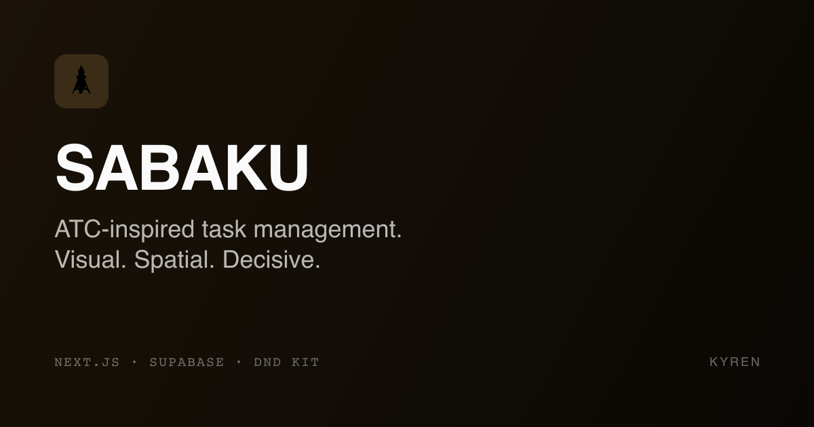

<div align="center">
  

  <h1>SABAKU</h1>

  <p><strong>Flight strip task management. Visual, spatial, decisive.</strong></p>

  <p>
    <a href="https://sabaku.kyren.app">Live demo</a>
    &nbsp;·&nbsp;
    <a href="https://kyren.app">Kyren</a>
    &nbsp;·&nbsp;
    <a href="https://x.com/masatobuilds">@masatobuilds</a>
  </p>

  <p>
    
    
    
    
    
  </p>
</div>

---

> One task at a time. Keyboard-first. Obsidian-native. For deep work.

**Live demo:** [sabaku.kyren.app](https://sabaku.kyren.app)

SABAKU is an air traffic control inspired task manager. Each task is a "flight strip" — a horizontal card with ID, priority, title, and timer. The system enforces single-task focus: only one strip can be ACTIVE at a time.

Built for Obsidian daily-journal power users who already write tasks in their vault and want zero-input-cost task execution.

---

## Why SABAKU?

**The problem:** Multitasking costs cognitive switching time. Todoist / Notion / Linear are too general — they don't enforce focus. Sunsama / Akiflow are $15-20/mo and disconnect from your notes.

**The approach:** If you already write tasks in Obsidian daily notes (`### Today's Top 3`, `- [ ]` checkboxes, `## 📝 TODO`), SABAKU parses and surfaces them automatically. You pick one, start a timer, finish, move on.

**The philosophy:** Like an air traffic controller handling one plane at a time, you handle one task at a time. The rest wait in QUEUE.

---

## Features

- **Kanban board**: ACTIVE (max 1) / QUEUE / CLEARED with drag-and-drop
- **Focus view**: Single active strip, large timer, minimal chrome
- **Obsidian Vault sync** (CLI): Auto-parse Top 3, checkboxes, and TODO sections from daily notes
- **Project grouping**: Auto-detected from hashtags (`#kashite`) or file paths (`handoff/kashite-*.md`)
- **Keyboard-first**: `n` new, `s` timer, `d` done, `q` back to queue, `↑↓⏎` navigate, `1/2` switch views, `p` cycle projects
- **Timer accuracy**: Wall-clock based (accurate even with inactive tabs)
- **Local storage**: Your data never leaves your browser unless you opt into Pro sync
- **Project analytics**: Today / week / all-time cleared counts and time tracked per project

---

## Tech Stack

- **Frontend:** Next.js 16 (App Router) · React 19 · TypeScript · Tailwind CSS v4
- **Backend:** Supabase (PostgreSQL + RLS + Auth) — Pro tier
- **Sync CLI:** Node.js · chokidar · unified/remark · SHA-256 hash-based diff
- **Tests:** Vitest (40 tests: parsers, hash, sync, utils)
- **Deployment:** Vercel · Cloudflare DNS

---

## Local development

```bash
# Install
pnpm install

# Run dev server
pnpm dev

# Run tests
pnpm test          # frontend
pnpm test:sync     # sync CLI parsers

# Build
pnpm build

# Sync CLI — scan Obsidian Vault
pnpm sync:dry      # preview
pnpm sync:once     # one-time scan
pnpm sync          # watch mode
```

Configure the sync CLI by creating `sabaku-sync.config.json`:

```json
{
  "vaultPath": "/path/to/Obsidian Vault",
  "watchPaths": ["010-journal/daily", "010-journal/handoff"],
  "parseRules": {
    "top3": true,
    "checkboxUnchecked": true,
    "checkboxChecked": true,
    "todoSection": true
  }
}
```

---

## Architecture

```
sabaku/
├── src/
│   ├── app/
│   │   ├── page.tsx          # Main app
│   │   ├── landing/page.tsx  # Marketing page
│   │   └── layout.tsx
│   ├── components/           # Strip UI, modals, views
│   ├── hooks/                # useStrips, useTimer, useKeyboardShortcuts
│   └── lib/                  # utils + tests
├── packages/
│   └── sync/                 # Obsidian Vault → SABAKU CLI (MIT)
│       ├── src/parsers/      # Top3, checkbox, TODO section parsers
│       ├── src/lib/          # Scanner, hash, sync engine, project inference
│       └── tests/            # 30 tests
├── supabase/
│   └── migrations/           # strips, time_logs, sync_history, projects
└── docs/                     # Architecture, strategy, devil's advocate
```

---

## Project docs

- [`docs/00-devils-advocate.md`](docs/00-devils-advocate.md) — Initial skeptical analysis (should we build?)
- [`docs/01-market-research.md`](docs/01-market-research.md) — Competitive landscape (Todoist, Sunsama, Akiflow, Obsidian plugins)
- [`docs/02-uiux-spec.md`](docs/02-uiux-spec.md) — Design tokens, view specs, interaction patterns
- [`docs/03-test-strategy.md`](docs/03-test-strategy.md) — Test pyramid + edge cases
- [`docs/04-usage-guide.md`](docs/04-usage-guide.md) — Daily workflow with Obsidian
- [`docs/05-devils-advocate-v2.md`](docs/05-devils-advocate-v2.md) — Post-v0.2 review: recruiters, pricing, retention
- [`docs/06-monetization.md`](docs/06-monetization.md) — Pricing strategy + roadmap to $1K MRR

---

## Roadmap

### v0.1 (shipped)
- [x] Kanban + Focus views
- [x] Drag-and-drop
- [x] Keyboard shortcuts
- [x] Vault sync CLI
- [x] Project auto-detection

### v0.2 (shipped)
- [x] English UI throughout
- [x] Strip detail modal (edit/delete)
- [x] Landing page with pricing
- [x] First-time onboarding
- [x] Stats panel
- [x] JSON export
- [x] Wall-clock timer

### v0.3 (in planning)
- [ ] Supabase Auth + cloud sync (Pro tier)
- [ ] `/pricing` page + Stripe Checkout
- [ ] Gumroad Lifetime license
- [ ] Obsidian plugin wrapper

### v1.0 (future)
- [ ] Timeline view (time_logs visualization)
- [ ] Weekly review generator
- [ ] Team workspace
- [ ] iCal / Google Calendar block integration

---

## License

MIT for open-source components (`packages/sync/` and UI code).
Pro tier uses proprietary cloud sync infrastructure.

---

## Part of Kyren

SABAKU is the fourth product in the [Kyren](https://kyren.app) product suite:

- **KASHITE** — P2P lending tracker
- **YOMU** — Reading list manager
- **Phrasely** — AI English rewriter
- **SABAKU** — Flight strip task management ← _you are here_

Built by [@masatonaut](https://github.com/masatonaut).
